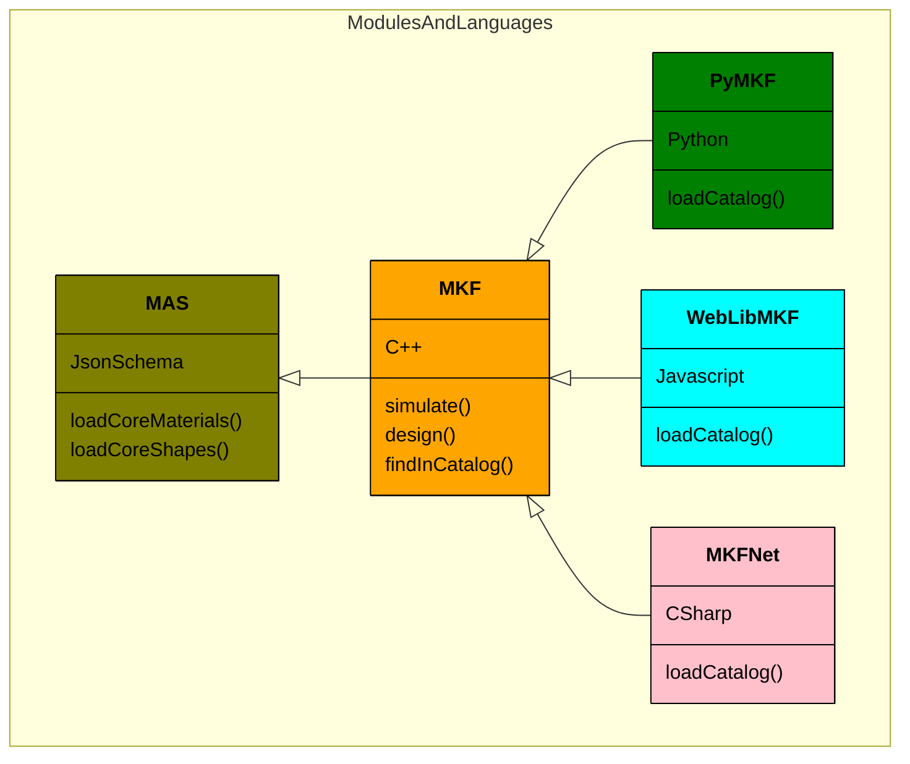
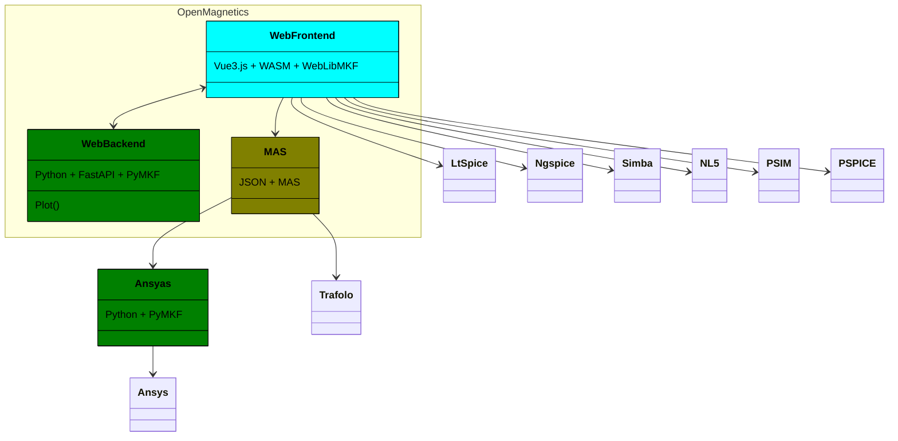

Open Magnetics is a an open-source platform for collecting and sharing knowledge about Magnetic Components

```mermaid
classDiagram
    MKF <|-- PyMKF
    MKF <|-- WebLibMKF
    MKF <|-- MKFNet
    MAS <|-- MKF
    

    namespace ModulesAndLanguages {
        class MKF{
            C++
            simulate()
            design()
            findInCatalog()
        }
        class PyMKF{
            Python
            loadCatalog()
        }
        class WebLibMKF{
            Javascript
            loadCatalog()
        }
        class MKFNet{
            CSharp
            loadCatalog()
        }
        class MAS{
            JsonSchema
            loadCoreMaterials()
            loadCoreShapes()
        }
    }
    
    style MKF fill:orange,stroke:black,color:black
    style PyMKF fill:green,stroke:black,color:black
    style WebLibMKF fill:cyan,stroke:black,color:black
    style MKFNet fill:pink,stroke:black,color:black
    style MAS fill:olive,stroke:black,color:black


```

```mermaid
classDiagram
    namespace OpenMagnetics {
        class WebFrontend {
            Vue3.js + WASM + WebLibMKF
        }
        
        class WebBackend {
            Python + FastAPI + PyMKF
            Plot()
        }
        
        class MAS {
            JSON + MAS
        }
    }
    class Ansyas {
        Python + PyMKF
    }
    class Ansys
    class Trafolo
    class LtSpice
    class Ngspice
    class Simba
    class NL5
    class PSIM
    class PSPICE

    WebFrontend <--> WebBackend
    WebFrontend --> MAS
    MAS --> Trafolo
    MAS --> Ansyas
    Ansyas --> Ansys
    WebFrontend --> LtSpice
    WebFrontend --> Ngspice
    WebFrontend --> Simba
    WebFrontend --> NL5
    WebFrontend --> PSIM
    WebFrontend --> PSPICE

    style MKF fill:orange,stroke:black,color:black

    style PyMKF fill:green,stroke:black,color:black
    style WebBackend fill:green,stroke:black,color:black
    style Ansyas fill:green,stroke:black,color:black
    style WebFrontend fill:cyan,stroke:black,color:black
    style WebLibMKF fill:cyan,stroke:black,color:black
    style MAS fill:olive,stroke:black,color:black
```
